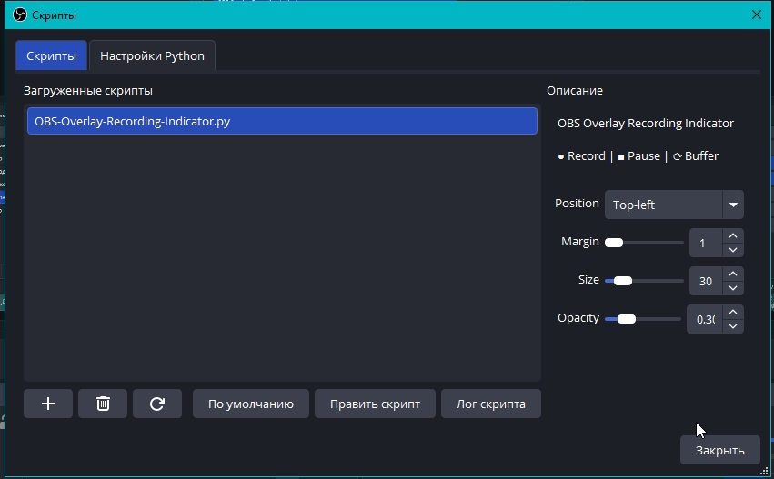

# OBS Overlay Indicator

A lightweight OBS Studio script that draws a status overlay (recording, pause, replay buffer) directly on your screen. 

The main reason this script was made — to have a clear visual confirmation of the recording status when working on a single monitor, without the need to switch back to the OBS window.

## Features:
- **Click-Through** — The overlay does not interfere with mouse clicks or window focus.
- **Status** — Displays different symbols for recording (●), pause (■), and replay buffer (⟳) events.
- **Customizable Placement** — Choose any screen corner and adjust margins via the OBS script properties.

## Requirements:
- **Python 3.10+** (must be the same architecture as your OBS, usually x64).
- **Tkinter library** — Included by default in most Python installers. 
  - *Windows:* Make sure "tcl/tk and IDLE" was checked during Python installation.
  - *Linux:* You might need to install it manually (e.g., `sudo apt install python3-tk`).

## Installation:
1. Download the `obs_overlay.py` file.
2. Open OBS Studio: `Tools` -> `Scripts`.
3. Go to the **Python Settings** tab and select the path to your Python installation folder.
4. Go back to the **Scripts** tab, click the `+` button and select the script.
5. Enjoy.
